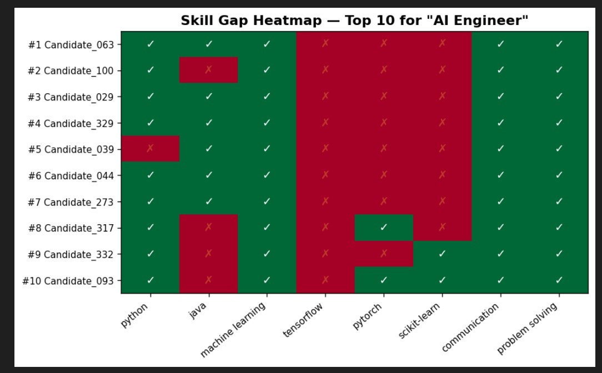
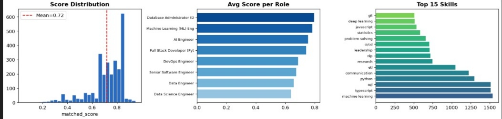

#  ML Resume Screening & Ranking System

A Machine Learning system that automatically screens, scores, and ranks 
resumes based on a given job role — built using Python and scikit-learn.

## 📌 Problem Statement

Hiring teams receive hundreds of resumes for a single job role. 
Manually reading each resume is slow, inconsistent, and error-prone.

This system solves that by:
- Automatically screening resumes
- Matching skills with job requirements
- Ranking candidates by role fit
- Identifying missing or weak skills
- Reducing recruiter workload

##  Objective

Build an ML system that can:
- Read resume text from dataset
- Extract skills and relevant keywords
- Compare resumes with a job description
- Rank candidates based on role fit
- Highlight missing or required skills

##  Dataset

**Kaggle Resume Dataset**
- 9,544 real resumes
- 8 tech job roles
- Contains skills, experience, education, responsibilities

**Roles Covered:**
- AI Engineer
- Machine Learning (ML) Engineer
- Data Engineer
- Data Science Engineer
- Senior Software Engineer
- DevOps Engineer
- Full Stack Developer (Python, React js)
- Database Administrator (DBA)

##  Tools & Libraries

| Tool | Purpose |
|---|---|
| Python | Core programming language |
| Jupyter Notebook | Development environment |
| VS Code | Code editor |
| scikit-learn | TF-IDF, cosine similarity, ML models |
| pandas | Data loading and manipulation |
| numpy | Numerical computations |
| matplotlib | Charts and visualizations |

##  How It Works

### Step 1 — Text Cleaning
- Converts text to lowercase
- Removes punctuation and special characters
- Removes stop words

### Step 2 — Skill Extraction
- Uses a custom skill taxonomy of 45+ skills
- Matches resume text against known skills
- Extracts canonical skill names

### Step 3 — TF-IDF Vectorization
- Converts resume and job description text to vectors
- Uses bigrams for better context
- Computes cosine similarity between resume and JD

### Step 4 — Feature Engineering
8 features extracted for each candidate:

| Feature | Description |
|---|---|
| tfidf_sim | Cosine similarity between resume and JD |
| skill_jaccard | Jaccard overlap of skill sets |
| matched_count | Number of matched skills |
| missing_count | Number of missing skills |
| bonus_count | Number of extra skills |
| exp_score | Normalised years of experience |
| edu_score | Education level score |
| kw_density | Keyword density overlap |

### Step 5 — ML Model Training
- Model used: Gradient Boosting Regressor
- Train/Test split: 80/20
- Target: matched_score from dataset
- Evaluation: RMSE and R²

### Step 6 — Candidate Ranking
- Predicts score for each candidate
- Sorts candidates from highest to lowest
- Shows top 10 candidates with full details

### Step 7 — Skill Gap Analysis
- Shows matched skills ✅
- Shows missing skills ❌
- Shows bonus skills ⭐
- Visual heatmap for top 10 candidates

## 📊 Output

### Ranking Report

### Skill Gap Heatmap

### Charts

##  Model Performance

| Metric | Value |
|---|---|
| RMSE | 0.1143 |
| R² | 0.3214 |
| Training samples | 2,723 |
| Features used | 8 |

##  Why Candidates Rank Higher

A candidate ranks higher when they have:
- ✅ More matched skills from job description
- ✅ Higher TF-IDF similarity with job description
- ✅ More years of relevant experience
- ✅ Higher education level
- ✅ Higher keyword density match

## ❌ Why Candidates Rank Lower

A candidate ranks lower when they have:
- ❌ More missing skills
- ❌ Low TF-IDF similarity
- ❌ Less years of experience
- ❌ Lower education level

##  How to Run

### Step 1 — Clone the repository bash
git clone https://github.com/YourName/resume-screening-ml.git

### Step 2 — Install libraries
bash
pip install scikit-learn pandas numpy matplotlib

### Step 3 — Update CSV path
python
CSV_PATH = r'your\path\to\1774016581819_resume_data.csv
### Step 4 — Choose your role
python
ROLE = 'AI Engineer'  
### Step 5 — Run the notebook
Shift + Enter

##  Project Structure
resume-screening-ml/
│
├── resume_screening.ipynb   
├── README.md                
└── screenshots              
    ├── featured importance.png
    ├── heatmap.png
    └── charts.png

##  Skills Gained

- Text cleaning and preprocessing
- NLP skill extraction
- TF-IDF vectorization
- Cosine similarity scoring
- Feature engineering
- Gradient Boosting model training
- Candidate ranking system
- Skill gap identification
- Data visualization

##  Real World Use Case

This system mirrors how real resume screening tools work in:
- HR-tech startups
- Recruitment platforms
- Enterprise hiring tools
- Applicant Tracking Systems (ATS)

##  Note

This project is built for learning purposes as part of an 
ML internship task. Dataset is from Kaggle and all 
candidate data is anonymized.
